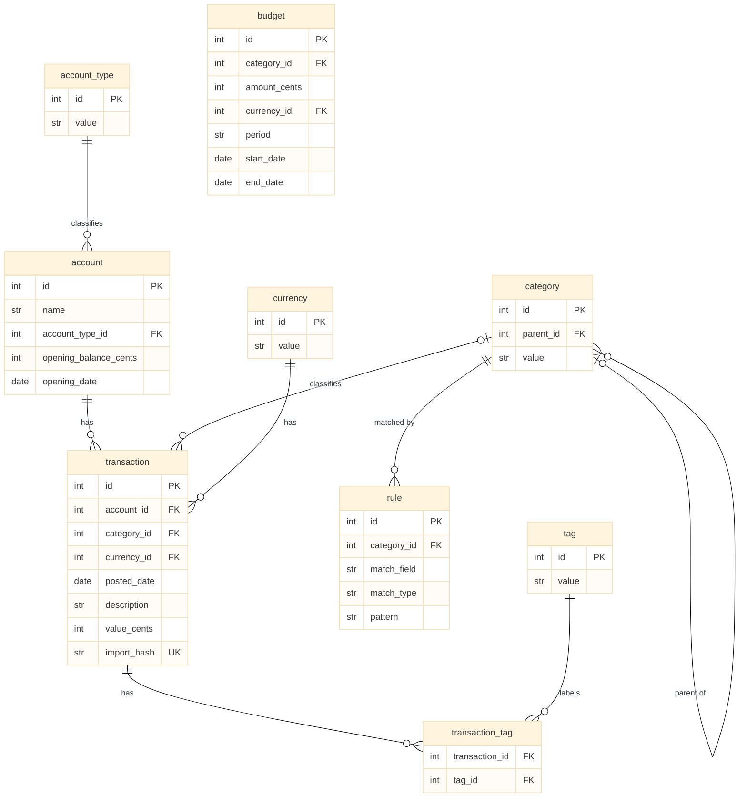

# Budget tracker

- [Budget tracker](#budget-tracker)
  - [Overview](#overview)
  - [Technical details](#technical-details)
  - [Database schema](#database-schema)

## Overview

This is a project for tracking personal budgets. The planned features are the following:

1. [Todo] Import transaction records exported by banks or credit cards.
2. [Todo] Auto-categorize transactions based on their source, description, and amount. Allow the user to override auto-categorization, and learn from the user's inputs.
3. [Todo] Produce visualizations of historical spending and income amounts.
4. [Todo] Produce projections of future balances.
5. [Todo] Display details in a command-line interface.
6. [Todo] Display details in a graphical interface if desired.
7. [Todo] Connect to bank / credit card / broker APIs to read the user's current financial state.

## Technical details

The project is mostly written in Python, preserving the possibility of using C++ for hot loops.

The software maintains a local SQL database for transaction records. The project uses `SQLAlchemy` to handle SQL easily within Python, and to maintain the possibility of future cloud hosting of the SQL database if desired.

For now, we use a command-line interface for user interactions. In the future, we hope to expand to a graphical interface.

## Database schema

Conventions: money is stored as a single integer number of cents (`value_cents`,
signed — negative = outflow) to avoid floating-point rounding; dates/times are stored
in UTC as ISO-8601. A transaction's `category_id` is nullable (NULL = uncategorized).

