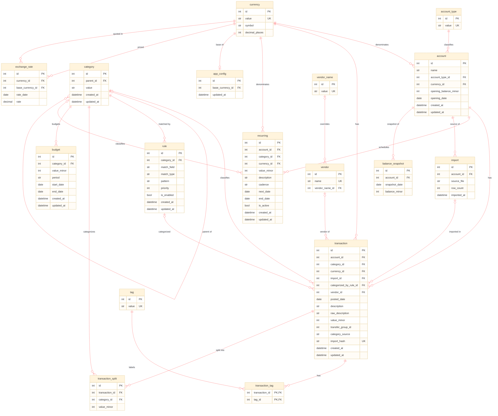

# Budget tracker

[](https://github.com/Benkendorfer/budget_tracker/actions/workflows/tests.yml?query=branch%3Amain)

- [Budget tracker](#budget-tracker)
  - [Overview](#overview)
  - [How to run](#how-to-run)
    - [Setup](#setup)
    - [The interactive app](#the-interactive-app)
    - [The command line](#the-command-line)
    - [Renaming and grouping vendors](#renaming-and-grouping-vendors)
    - [Vendor rename rules](#vendor-rename-rules)
    - [Importing data](#importing-data)
    - [Where the data lives](#where-the-data-lives)
    - [Running the tests](#running-the-tests)
  - [Technical details](#technical-details)
  - [Database schema](#database-schema)
  - [Data protection / security](#data-protection--security)

## Overview

This is a project for tracking personal budgets. The planned features are the following:

1. [Todo] Import transaction records exported by banks or credit cards.
2. [Todo] Auto-categorize transactions based on their source, description, and amount. Allow the user to override auto-categorization, and learn from the user's inputs.
3. [Todo] Produce visualizations of historical spending and income amounts.
4. [Todo] Produce projections of future balances.
5. [Todo] Display details in a command-line interface.
6. [Todo] Display details in a graphical interface if desired.
7. [Todo] Connect to bank / credit card / broker APIs to read the user's current financial state.

## How to run

### Setup

Requires Python 3.9 or newer. From the repository root:

```bash
python3 -m venv .venv
source .venv/bin/activate
pip install -e ".[dev]"
```

This installs the dependencies (`SQLAlchemy`, `textual`) and puts a `budget` command on
your path. The `[dev]` extra adds `pytest`; drop it if you do not intend to run the tests.

### The interactive app

Running `budget` with no arguments launches the full-screen TUI:

```bash
budget          # equivalent to: budget tui
```

The sidebar lists accounts, vendors, and categories — click any row to filter the
transaction table, and the totals line updates to match. Type commands into the bar at
the bottom:

| Command | Effect |
| --- | --- |
| `import` | Import every CSV in `data/to_import/` |
| `import <path>` | Import a single CSV |
| `rename <raw vendor> = <display name>` | Give one vendor a readable name (see below) |
| `rule <pattern> = <display name>` | Rename every matching vendor, now and in future imports |
| `rules` | List the rules you have defined (`rule` on its own does the same) |
| `all` | Clear all filters |
| `refresh` | Reload from the database |
| `help` | Show this list in-app |
| `quit` | Exit |

Keyboard shortcuts: `ctrl+l` clears filters, `ctrl+r` refreshes, and `ctrl+c` quits.

`ctrl+n` prefills a `rename` command for whichever vendor you are pointing at. With the
transaction table focused, that is the vendor of the transaction under the cursor —
which works even for vendors you have already grouped, because each row remembers the
raw merchant string. Otherwise it falls back to the vendor sidebar: the active vendor
filter if there is one, else the highlighted row.

### The command line

The same operations are available as subcommands, which is handy for scripting:

```bash
# Import a CSV. With no path, pick interactively from data/to_import/.
budget import ~/Downloads/statement.csv
budget import --currency EUR ~/Downloads/statement_eur.csv

# List transactions, most recent first (default limit: 50).
budget list
budget list --account "Card 8207" --limit 100
budget list --category Dining
budget list --vendor Coffee          # accepts a raw name or an override name

# Give a raw vendor string a readable display name.
budget rename "COFFEE SHOP A" "Coffee"
```

`budget --help`, or `budget <subcommand> --help`, documents every flag.

### Renaming and grouping vendors

Imports record the bank's raw merchant string as the vendor. `rename` points that raw
string at a readable name, and **reusing the same display name aggregates several raw
vendors into one group**:

```bash
budget rename "COFFEE SHOP A" "Coffee"
budget rename "COFFEE SHOP B" "Coffee"   # both now report under "Coffee"
```

Renames are stored separately from transactions and survive re-importing — the importer
matches vendors on the raw string and never overwrites an existing display name. Note
that the match is exact, so if your bank starts exporting a new variant of the string
(`COFFEE SHOP A #4471`), that variant arrives as a separate, un-renamed vendor. Use a
rule instead when you expect variants.

### Vendor rename rules

Sometimes, one merchant arrives as many raw vendors, like `Kindle Svcs*BY3UO9RV2`, `Kindle Svcs*BS4XF2Z70`, and so
on. A rule renames all of them at once, including any that show up in later imports:

```bash
budget rule add "Kindle Svcs*" "Kindle"    # 5 vendors updated
budget rule add "AMAZON*" "Amazon"         # catches AMAZON MKTPL*, Amazon.com*, ...
budget rule list
budget rule remove "AMAZON*"               # reverts the vendors it had named
budget rule apply                          # re-run every rule
```

In the app, the equivalent command is `rule Kindle Svcs* = Kindle`, and `rules` (or a
bare `rule`) lists what you have defined. The listing shows the first 12 rules and then
points at `budget rule list` for the rest, since a notification is a poor place for a
long list. Removing a rule is CLI-only for now.

Patterns are shell-style globs (`*` and `?`) matched case-insensitively against the raw
vendor name. Note that `*` is a wildcard in the pattern even though banks often emit it
literally — which is precisely why `Kindle Svcs*` is the natural pattern for
`Kindle Svcs*BY3UO9RV2`. A pattern with no wildcard matches exactly, so use `*CAVA*` to
match anywhere in the string. When several rules match, the oldest one wins.

Rules and manual renames coexist predictably, because each vendor records which set its
name:

- **A manual `rename` always wins.** Rules skip vendors you have renamed by hand, so
  applying a broad rule can never undo a deliberate choice.
- **Rules own the vendors they name.** Re-pointing a rule to a different name updates
  them, and removing a rule reverts them to their raw names.
- **Imports apply rules automatically**, so new merchant variants are folded in without
  a manual step. `budget rule apply` is only needed if the database is changed outside
  the app.

Rules are stored, not baked in: they are re-evaluated rather than rewriting transactions,
and `raw_description` always preserves the bank's original text.

### Importing data

The importer currently reads Capital One-style CSV exports with these columns:

```text
Transaction Date, Posted Date, Card No., Description, Category, Debit, Credit
```

`Debit` is a charge (stored as a negative amount) and `Credit` is a payment or refund
(positive). Files are read as UTF-8 or Windows-1252, so accented merchant names import
cleanly. Re-importing the same file is safe: each row gets a content hash, and rows
already present are reported as duplicates and skipped rather than doubled.

Dropping statements into `data/to_import/` lets you import them without typing paths —
`budget import` prompts you to choose one, and the TUI's `import` command takes them all
at once.

### Where the data lives

The SQLite database is created on first run at `data/budget.db`, and the tables are
created automatically — there is no migration step. Set the `BUDGET_DB` environment
variable to point at a different file, which is useful for keeping a scratch database
separate from your real one:

```bash
BUDGET_DB=/tmp/scratch.db budget import ~/Downloads/statement.csv
```

### Running the tests

```bash
pytest
```

The suite covers CSV importing, vendor overrides, and the TUI's rename shortcut. It
builds a temporary database per test, so it never touches `data/budget.db`.

## Technical details

The project is mostly written in Python, preserving the possibility of using C++ for hot loops.

The software maintains a local SQL database for transaction records. The project uses `SQLAlchemy` to handle SQL easily within Python, and to maintain the possibility of future cloud hosting of the SQL database if desired.

For now, we use a command-line interface for user interactions. In the future, we hope to expand to a graphical interface.

## Database schema

Conventions:

- Money is stored as an integer count of the currency's minor unit (`value_minor`,
  signed, negative = outflow) to avoid floating-point rounding. The number of minor
  units per major unit is given by `currency.decimal_places` (e.g. 2 for USD, 0 for JPY).
- `budget.value_minor` and `recurring.value_minor` use the same signed convention as
  transactions (negative = expense/outflow, positive = income/inflow).
- The application has a single **base currency** (`app_config.base_currency_id`), which
  the user can change at any time. Budgets are always expressed in the base currency
  (there is no per-budget currency).
- `exchange_rate` records one row per currency per day: `rate` is the value of 1 unit of
  `currency_id` expressed in `base_currency_id` on `rate_date`. `base_currency_id` is
  stored on each row so changing the base currency never corrupts historical rates; the
  base currency itself has an implicit rate of 1. Non-base transactions are converted to
  base **at report time** using the rate on their `posted_date` — converted amounts are
  not stored, so all reports reflect the current base currency.
- Dates/times are stored in UTC as ISO-8601.
- A transaction's `category_id` is nullable (NULL = uncategorized). When
  `transaction_split` rows exist, the parent's `category_id` is NULL and the splits'
  `value_minor` sum to the parent's `value_minor`.
- `import_id` is nullable — NULL means the transaction was entered manually or synced
  from an API rather than imported from a file.
- Transfers between your own accounts share a `transfer_group_id` so both legs can be
  excluded from spending/income totals (avoids double-counting).
- `raw_description` preserves the bank's original text; `description` may be
  cleaned/normalized.
- Each transaction points to a `vendor` (the raw merchant string seen in the import).
  `vendor.vendor_name_id` is nullable: NULL means no override, so the raw `vendor.name`
  is the display name. Setting it points the vendor at a `vendor_name` row, which both
  gives a readable name and lets several raw vendors aggregate under one name. The
  **effective vendor name** (the override if present, else the raw name) is what the UI
  filters and groups by.
- `category_source` records how the category was assigned (`manual` / `rule` / `unset`);
  only `manual` labels are treated as ground truth when learning new rules.
  `categorized_by_rule_id` records which rule fired (NULL if none).
- Rules are applied in ascending `priority` order (most specific first) and skipped when
  `is_enabled` is false.
- Enum-like text columns use a fixed vocabulary, enforced with CHECK constraints:
  `budget.period` & `recurring.cadence` (`weekly`/`monthly`/`quarterly`/`yearly`),
  `rule.match_field` (`description`/`amount`/`account`), `rule.match_type`
  (`contains`/`equals`/`regex`), `category_source` (`manual`/`rule`/`unset`).
- Lookup `value` columns are UNIQUE (`account_type`, `currency`, `tag`, `vendor_name`,
  marked `UK`); `vendor.name` is UNIQUE; `category` is unique on `(parent_id, value)`.
  `exchange_rate` is unique on `(currency_id, base_currency_id, rate_date)`.
- Lookup tables (`account_type`, `currency`, `tag`, `vendor`, `vendor_name`) and pure
  join tables (`transaction_tag`) omit `created_at`/`updated_at`.



## Data protection / security

All user data is stored in the `data/` directory, which is `.gitignored`. Within that directory, all user data is stored locally.
